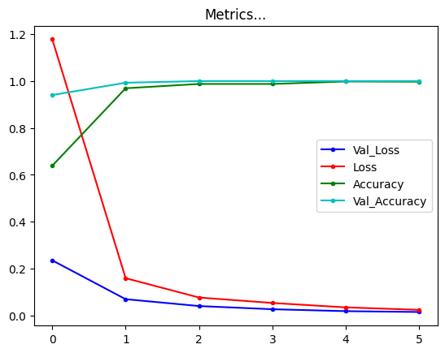

# Abdomen Abnorms

Detects for 9 classes of abdominal abnormalities

Classes:: ['abdominal_aorta_dilatation', 'aneurysmal_dilatation_of_aorta', 'aortic_aneurysm', 'cancer',
 'formation_of_adrenal_gland', 'kidney_development', 'liver_formation', 'urolithiasis', 'vertebral_compression_fracture']

 MobileNet used as a backbone model
 
With a batchsize 32, validation accuracy quickly surged and plateaud to 0.01 loss(*needs huger dataset)

## Accuracy charts

